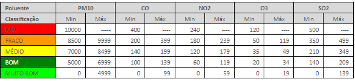

# Air Quality App
### Home Work #1


## Concept
An Application capapable of providing details on air quality for a certain region/city, for the current day and forecasts for upcoming days. 

Air quality will be based on this model available on [SNS site](https://www.dgs.pt/paginas-de-sistema/saude-de-a-a-z/qualidade-do-ar-ambiente/indice-de-qualidade-do-ar.aspx)



## Components
- Basic **Web Application** inteface
- **Restfull API**
- **Third Party API** access 
- **In-Memory Cache** System  

### Spring Project Organization:
```
Boundary -> Boundary Layer 
Service -> Service layer
Connection -> External API Access 
Data -> In-memory Cache logic
Model -> Oroject Models    

         Boundary 
            |
            v
       _ Service _     <->  Model 
      |           |
      v           v
  Connection     Data

```

 

## My Approach

1. Define the main **api endpoints/functionalities**
2. **Build the skeleton** of the whole system (create the layers, main scripts and connections)
3. Create **Unit tests** and then create the actual implementation based on them (using **Hamcrest**)
4. Create **Service tests** and then create the actual implementation based on them (using **Hamcrest**)
5. Create **Integation Tests** mocking the external API (using **Cucumber** and **Mockito**)
6. Create **Functional Tests** mocking the external API (using **Selenium**)
7. Finish code Implementation and correct all final bugs!


# Notes 

- Coverage will be evaluated in this HM