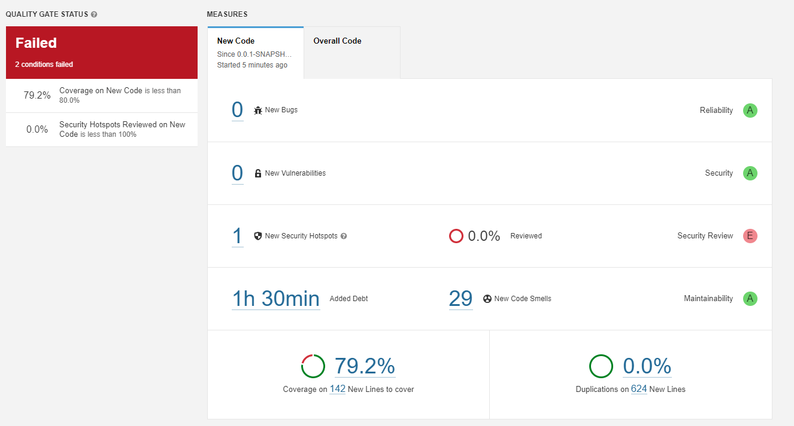

# 6.1

## f) 

It did not pass the defined quality gate, this project not only has a security concern but also the test dont cover over 80% of the lines of code

## g)

- Bugs -> None
- Vulnerabilities -> None
- Security hotspots -> **1**

**Problem:** Using pseudorandom number generators (PRNGs) is security-sensitive

**Solution:** Either conclude that is not a problem here wich is not the case (we are making a euromillion program the result must be unnpredictable) or, and the right solution, use a stronger random number generator 

- Code Smells -> **29**

From this 29 we can take the 12 major ones, and they end up falling into three categories:
1. Log Performance 
2. "for" loop stop conditions should be invariant
3. JUnit assertTrue/assertFalse should be simplified to the corresponding dedicated assertion

All of this problems are easily fixed just by either using the log/JunitAssertions the way they are inttended or by correcting basic good principles in coding(loop example)

