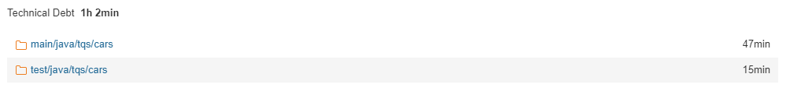
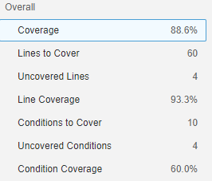
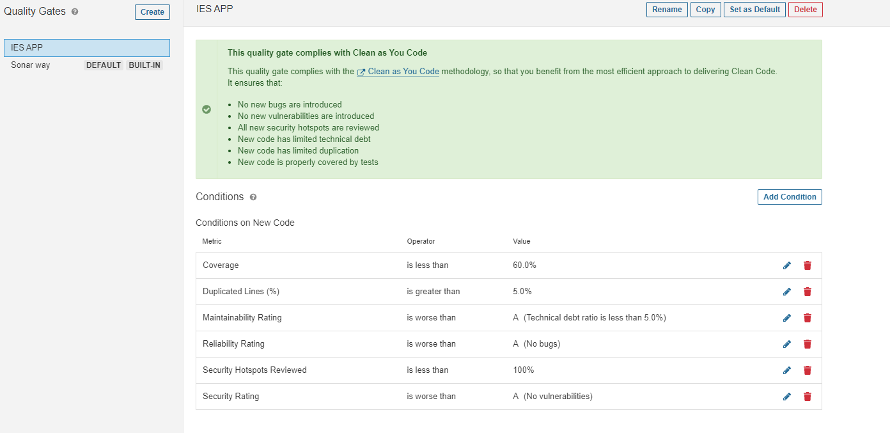
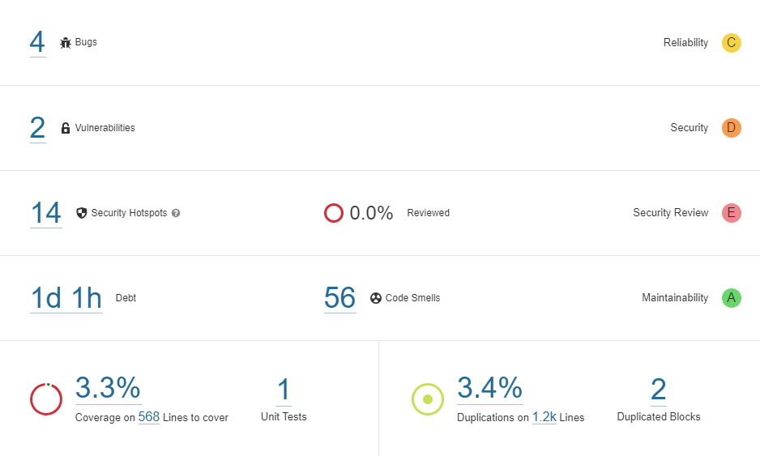

# 6.1

## f) 

It did not pass the defined quality gate, this project not only has a security concern but also the test dont cover over 80% of the lines of code

## g)

- Bugs -> None
- Vulnerabilities -> None
- Security hotspots -> **1**

**Problem:** Using pseudorandom number generators (PRNGs) is security-sensitive

**Solution:** Either conclude that is not a problem here wich is not the case (we are making a euromillion program the result must be unnpredictable) or, and the right solution, use a stronger random number generator 

- Code Smells -> **29**

From this 29 we can take the 12 major ones, and they end up falling into three categories:
1. Log Performance 
2. "for" loop stop conditions should be invariant
3. JUnit assertTrue/assertFalse should be simplified to the corresponding dedicated assertion

All of this problems are easily fixed just by either using the log/JunitAssertions the way they are inttended or by correcting basic good principles in coding(loop example)

# 6.2

## a)

 Technical Debt is a measure of compromise in the quality of code done to make up for quick delivery schedules

## d)

# 6.3
## a)

## b)
I dont think is necessary to add any code smells given the fact that it is already full of them.

This IES Project was made without the use of any tests or automatic analysis in a really short timespam, so it is completely flawed from a technical point of view.

This analysis just serves to prove how important testing/analysis is to developing a secure and well strutured application.

